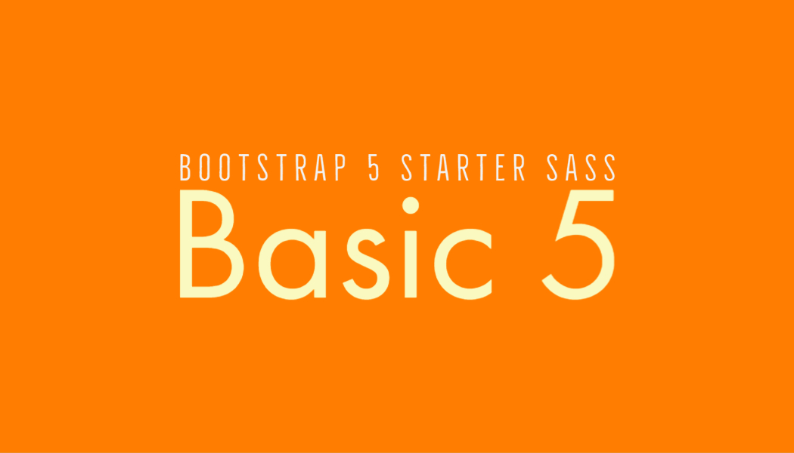

# Bootstrap 5 Boilerplate - Basic

1. ingresar por consola a la carpeta del proyectonpm /CleanCodeFood

2. comandos: npm install / npm install gulp -g / gulp serve 

3. https://bootstrapstarter.com/template-basic5-nom-html/

This is a Bootstrap 5 Boilerplate with Gulp 4+, cross-env, Sass, sourcemaps, concat, CSS & HTML minification, uglify, image optimization, template partials, BrowserSync.

[More in documentation](https://bootstrapstarter.com/template-basic5-bootstrap5-html/)

